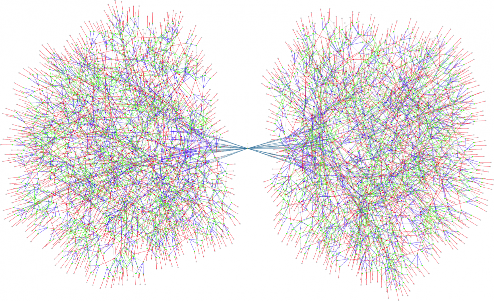
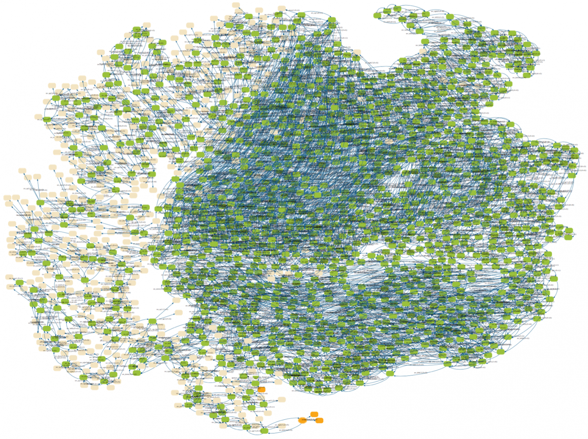
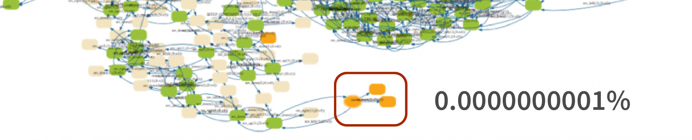

# 简介

> A distributed system is one in which the failure of a computer you didn't even know existed can render your own computer unusable.
>
> ---- Leslie Lamport

这本书讲的是分布式系统，但它不会告诉你当今最流行的分布式框架是什么，它也不会告诉你大名鼎鼎的 Raft 算法为什么是对的；

这本书会告诉你分布式系统为什么难，我们在分布式算法上得到了什么，Lamport 为什么是永远的神，以及怎样使用屠龙宝刀 TLA+。

## 一个例子

分布式系统的难题有很多，有网络分区、网络延迟、节点宕机等等，但这其实不是充分条件，没有网络问题一样可以发生不一致，我们来看一个编程领域经典的多线程问题：

有一个用于垃圾回收引用计数器，当复制一个对象指针时，它就将引用计数加一：

```cpp
int count = 0;

void increase() {
    int tmp = count + 1;
    count = tmp;
}
```

若有两个线程同时调用 `increase()`，它们会分别执行两步操作：

【图】

但是任何两个对 `count` 的操作不可能同时发生，要么这个先发生，要么那个先发生，所以两个线程的操作可以以任意顺序穿插在一起（同一线程的操作的先后顺序不变），一共有 6 种可能的路径：

【图】

我们发现最后 6 个状态中有 4 个 `count = 1`，这就发生了 count 变量的值与调用 `increase()` 的次数之间的不一致。

多线程问题和分布式系统问题其实是一样的，我们将上面例子中的线程换成分布式系统节点：

有两台 ATM 终端，它们正在同时向同一个账户汇款：

```cpp
void transfer(int account_id) {
    int balance = serverdb.read(account_id);
    serverdb.write(account_id, balance + 100)
}
```

这两个 ATM 最后加起来可能一共只汇了 100 元，没人知道剩下的 100 元去哪里了。

## 墨菲定律

【图】

【图】

假如我们把线程加到 5 个，那么状态数会是多少？

> 若 n 为线程数，m 为线程步数，状态数 = **`(m*n)*(m*n)!/m!`**

状态数将达到 【】 个！

一个投入生产环境的分布式系统有更多的节点、更多的步骤，这样的系统的状态空间往往长这样：



或着这样:



这种情况下，测试几乎不可能触及状态空间的所有角落。但是生产环境可以做到这一点。假如角落的几个状态代表系统发生了数据丢失，而触发它们的几率仅为万亿分之一： 



在一个 QPS 为 40k 的系统中，3 个月的时间已经足以到达这个状态导致灾难性后果。正如墨菲定律，**会出错的事总会出错**。

这还不是最糟的问题，单机程序遇到错误会 crash 停下来，而分布式系统出错时，你可能完全浑然不知，甚至还在想着下班去哪家奶茶店。于是你的系统就在错误的方向义无反顾地狂奔下去。

## TLA+ 是把屠龙刀

说 TLA+ 之前，我想先说说 TLA+ 的作者 Lamport 老爷子，很多人可能不知，以下作品都是老爷子的：

- Paxos
- TLA+
- LaTeX

而老爷子为了 TLA+ 呕心沥血，说他是分布式领域第一人不为过，他发表的 TLA+ 论文多如牛毛可见一斑 ······

【】

话说正题，TLA+ 本身并不是编程语言，也不能生成可执行程序。它是严谨的数学，却简单优雅，描述 TiKV 的事务模型仅仅用了 500 行不到，每一行都像自然语言般直白、流畅，却又有数学般的精确，准确地描述着状态空间每一步的初始条件、动作以及结果。

TLA+ 提供了两套系统验证我们描述的状态空间:

- TLC，属于 Model Checker，通过暴力穷举遍历状态空间。
- TLAPS，形式化证明器，通过数学方法手动证明算法正确性。

大多数情况下，我们只需要使用 TLC 就能完整验证分布式算法，不需要涉及数学证明的知识。另外，TLA+ 也是极优秀的传播算法知识的工具，我们读完算法论文后往往对一些细节半知半解，想要了解准确严谨的实现，就可以找 TLA+。如果对算法的某个部分产生疑惑，大可以注释掉然后运行 TLC，看看哪里会出错。

## TLA+ 靠谱吗

根据目前可以公开的情报，正在核心组件上应用 TLA+ 的公司有：

- AWS
- Amazon
- Azure
- Xbox
- Elastic Search
- MongoDB
- Intel (用于验证 CPU 硬件设计)
- PingCAP

据称，他们都通过 TLA+ 发现了算法犄角旮旯里的 Bug，可谓性价比极高。
